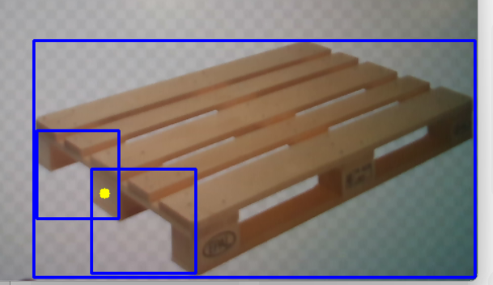

# Pallet Detection and Distance Calculation

This repository provides two functionalities: pallet detection with distance calculation and real-time pallet detection.

## Features
1. **Pallet Detection and Distance Calculation:**  
   Detects pallets and calculates the distance between the pallet and the camera using a RealSense camera.  
2. **Real-Time Pallet Detection Only:**  
   Performs real-time pallet detection without requiring a connected RealSense camera.

## Sample Output  
Below is an example of the real-time pallet detection output:

